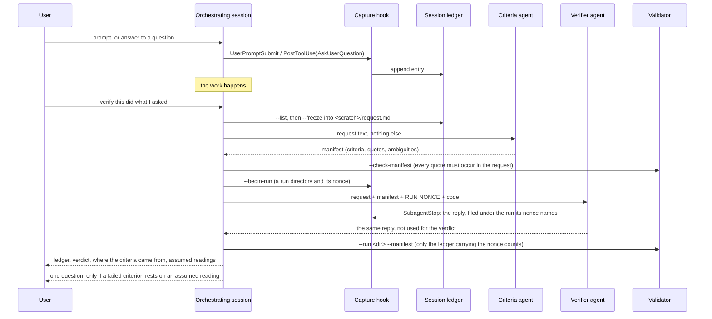

# intent-verify — architecture

How the plugin is put together: parts, flow, storage, contracts, what it needs
from Claude Code, and how to test and release it. This file is the reference
for an agent or a maintainer; grep the section you need.

Other documents answer other questions: `README.md` (why, and the evidence),
`CHANGELOG.md` (what changed), `docs/DESIGN-v0.3.md` (why the 0.3 choices were
made and what was left out), `docs/MODEL-COMPAT.md` (verifier tiers).

## 1. Parts

| Part | File | Runs as | Job |
|---|---|---|---|
| Capture hook | `hooks/capture-intent.js`, registered by `hooks/hooks.json` | `node`, started by Claude Code on `UserPromptSubmit`, on `PostToolUse` for `AskUserQuestion`, and on `SubagentStop` for `intent-verify:intent-verifier` | Append one entry to the session's ledger, or file the verifier's reply under its run. Never prints, never exits non-zero. |
| Reader | the same file: `--list`, `--show`, `--freeze`, `--begin-run` | `node`, run from a shell by the orchestrating session | List a session's entries; write chosen entries to one request file; start a verification run. |
| Skill | `skills/intent-verify/SKILL.md` | instructions to the orchestrating session | The procedure in section 2. |
| Criteria agent | `agents/criteria.md` (`intent-criteria`) | subagent with no tool that reads files or runs commands | Request text in, criterion manifest out. |
| Verifier agent | `agents/verifier.md` (`intent-verifier`) | subagent with `Read, Grep, Glob, Bash` | Request, manifest, run nonce and code in; a JSON ledger with evidence, carrying the nonce, out. |
| Validator | `tools/validate_ledger.py` | `python`, run by the orchestrating session | Check a manifest against the request; check the captured ledger (`--run`) against a manifest. |
| Selector | `tools/select_verifier.py`, `models/registry.json` | `python` | Pick the verifier's model, tier and protocol. |
| Benchmark | `benchmark/run_bench.py`, `oracle.py`, `cases.json` | `python` | Mock profiles offline; real models through the `claude` CLI. |
| Alternate hooks | `hooks/capture-intent.py`, `.ps1`, `.sh` | wired by hand where Node is missing | Record prompts in the 0.2 in-project layout. Not used by the plugin. |

The orchestrating session is whichever Claude Code session the user asked to
verify. It is usually also the session that wrote the code, which is why the
parts above exist: each takes something away from it. The criteria agent takes
away writing the criteria, the verifier takes away judging, the validator takes
away deciding whether the ledger is acceptable, and the `SubagentStop` hook
takes away carrying the verifier's reply to the validator.

## 2. Flow



Variations the skill allows:

- **The user has criteria already:** `--manifest-from` replaces the criteria
  agent.
- **The criteria agent cannot be dispatched, or returns no valid manifest after
  one re-request:** the orchestrating session writes the criteria and the
  report has to say they were not fixed independently.
- **Round 2 after a fix:** from the verifier onward, in a new run, with the
  same request and the same manifest. There is no round 3.
- **The hook filed nothing for the run** (`--run` exits 4: an older Claude Code,
  an alternate hook, or a reply without the nonce): the session saves the reply
  itself and checks it with `--nonce`, and the report says it was relayed.

## 3. Storage

### 3.1 The ledger

```
<data>/projects/<key>/project.json             {"path": "<normalised project dir>"}
<data>/projects/<key>/sessions/<session>.jsonl one JSON object per line
<data>/projects/<key>/runs/<nonce>/run.json     {"nonce", "created", "session_id"}
<data>/projects/<key>/runs/<nonce>/reply-<t>-<agent>.txt  a verifier reply, byte for byte
<data>/projects/<key>/runs/_unmatched/          verifier replies carrying no known nonce, and
                                                notes that the hook ran and found no reply
<data>/.pruned                                  stamp: retention last ran
```

- `<data>` when **writing**: `$INTENT_VERIFY_DATA`, else `$CLAUDE_PLUGIN_DATA`
  (set by Claude Code for plugin hooks; `~/.claude/plugins/data/<plugin id>/`),
  else `~/.claude/intent-verify`.
- `<data>` when **reading**: `--data` if given; else `$INTENT_VERIFY_DATA`; else
  `$CLAUDE_PLUGIN_DATA`, every `~/.claude/plugins/data/intent-verify*`
  directory and `~/.claude/intent-verify`, merged. The extra places exist
  because `CLAUDE_PLUGIN_DATA` is not in the environment of commands a session
  runs through its shell; the skill passes `--data` and the reader does not
  depend on that having worked.
- `<key>`: first 16 hex digits of sha256 of the project path, normalised
  (absolute, forward slashes, no trailing slash, lower case on Windows).
- `<session>`: the session id with anything outside `[A-Za-z0-9_-]` replaced;
  `_nosession` when the payload had none.
- **Runs:** `--begin-run` makes one, named by 16 random bytes in hex. The
  `SubagentStop` hook looks for that nonce in the verifier's reply and searches
  every root the reader would read, so a run started with another `--data` or
  `--project` is still found.
- **Retention:** at most once a day the hook deletes `*.jsonl` session files,
  run directories and unmatched replies not written to for
  `INTENT_VERIFY_RETENTION_DAYS` (default 30; 0 disables), and only inside
  project directories it created. Nothing else is ever deleted.
- **Legacy:** the reader also reads `<project>/.intent/log.jsonl` (0.2.x, or an
  alternate hook) and merges it. The Node hook never writes there.

### 3.2 A run's working files

The skill keeps them in a scratch directory the orchestrating session chooses,
never in the project and never in `<data>`: `request.md`, `criteria-reply.txt`,
`manifest.json`, `round`, and `ledger.txt` only when the hook filed nothing. The
verifier's reply itself is in the run directory under `<data>` (3.1).

## 4. Contracts

### 4.1 Ledger entry

```json
{"id": "muvbel8g-165c", "ts": "2026-10-05T13:58:08.128Z", "kind": "task",
 "prompt": "…", "session_id": "…", "prompt_id": "…", "cwd": "…",
 "transcript_path": "…", "truncated": true, "redactions": 2, "reason": "…"}
```

| `kind` | Written when | `prompt` holds |
|---|---|---|
| `task` | any prompt that is not one of the below | the prompt, redacted, capped |
| `verify-invocation` | the prompt unmistakably asks for this skill to run | the prompt |
| `decision` | the user answered an `AskUserQuestion` | `Q:` / options / `A:` per question |
| `capture-incomplete` | hook input was too large to parse (over 10 MiB) | empty; `reason` says why |

`truncated`, `redactions` and `reason` appear only when they apply. Prompts the
harness submits itself are not a `kind`: the reader recognises them by their
opening tag (`<task-notification>`, `<agent-message>`, `<scheduled-task>`,
`<ci-monitor-event>`) and labels them when listing. An agent's report — a
`<task-notification>`, or an `<agent-message>` framed "[Subagent hand-back]" —
is labelled `agent-report` and left out unless `--all` is given.

### 4.2 Criterion manifest

```json
{"manifest": 1,
 "criteria": [{"id": 1, "text": "one line", "quote": "words from the request, or null"}],
 "ambiguities": [{"question": "two readings of what?", "assumed": "the reading the criteria use",
                  "criteria": [1]}]}
```

Valid when: the reply is that object, with nothing after it and no key that is
unknown or written twice; `criteria` is a non-empty list; ids run 1..N in order;
each `text` is one non-empty line; each `quote` is null, or four characters or
more that occur in the request as whole words (spacing, case and curly or
straight quote marks ignored); each ambiguity names existing criteria and the
reading they assume. An ambiguity that names no criterion, including a bare
string from a 0.3.1 deriver, is dropped and counted (`unlinked_ambiguities`): no
answer to it could change the verdict. The validator also lists parts of the
request no quote touches, as notes.

### 4.3 Verifier ledger

The verifier writes one JSON object. Since 0.4.2 it is version 2:

```json
{"ledger": 2, "nonce": "<run nonce>", "mode": "FULL",
 "criteria": [{"id": 1, "text": "...", "verdict": "PASS", "cmd": "...", "out": "..."},
              {"id": 2, "text": "...", "verdict": "NOT-EXERCISED", "reason": "..."}],
 "final": "MATCHES INTENT", "observations": "optional", "seal": "<run nonce>"}
```

The template is in `agents/verifier.md`. `validate_json` reads the object that
the reply's first `{` opens and applies the rules of 4.4 to it directly
(`_check`, shared with the text grammar). A ledger the code under test printed
cannot carry the nonce, and inside the object captured output is a JSON string,
so neither can pass for the verifier's own. A reply is invalid, and is never
resolved silently, when:

- **Anything follows the object**, a closing code fence aside. That is where a
  second conclusion went: a draft followed by its correction used to be read as
  the draft, and so did a correction that was cut off or did not parse. A
  sentence before the object is tolerated.
- **A key is written twice**, at any depth, in the ledger or in a manifest.
  Python's decoder keeps the last one, so `"verdict": "FAIL", "verdict": "PASS"`
  read as PASS.
- **A key is not one of the format's**, at the top or in a criterion. Beside
  `"verdict": "PASS"`, a `"Verdict": "FAIL"` or a `"verdict_corrected": "FAIL"`
  was read by nobody.
- **The seal is missing, wrong, or not the last key.** Output pasted with a
  double quote left unescaped ends its string, and what follows it is parsed as
  ledger: it can supply verdicts and close the object. It cannot supply the
  nonce, so what it closes has no seal.
- **The nonce occurs anywhere but in `nonce` and `seal`.** In a command or in
  output, it has reached the code under test.

Evidence strings are kept exactly as written. Only the text grammar treats
output made of nothing but field-looking lines as missing, because there output
and fields share one stream of lines. In both, evidence that shows nothing
(spaces, a zero-width character) is missing.

`--unsealed` checks the version 1 object that 0.4.0 and 0.4.1 wrote: no seal,
remarks around it, unknown keys tolerated. It exists so that the runs kept in
`benchmark/results/` can still be checked. The skill never passes it.

`INTENT-VERIFY LEDGER v1`, the text grammar of 0.1 to 0.3, is still accepted
when no run is involved: a header line, a `mode:` line, `CRITERION n:` blocks
each with one `VERDICT:` and either `EVIDENCE-CMD:` + `EVIDENCE-OUT:` or
`REASON:`, and a `FINAL:` line. The rules are in the docstring of
`tools/validate_ledger.py`. The properties the tests pin down:

- A reply holding any `VERDICT` line that is not `PASS` cannot validate as
  `MATCHES INTENT`, whatever else is in it.
- With a manifest, a ledger missing any manifest criterion, or carrying it under
  another number or other words, is invalid.
- An indent shared by every line of the reply is removed before parsing. An
  indented ledger inside a reply that has unindented lines stays quoted text.

### 4.4 Verdicts

| Per-criterion verdicts | `FINAL` must be |
|---|---|
| any `FAIL` | `DRIFTED`, listing every failed criterion |
| no `FAIL`, at least one `NOT-EXERCISED` | `INCONCLUSIVE` |
| all `PASS` | `MATCHES INTENT`, those words and nothing after them |

The skill adds two caps of its own: a request that was truncated at capture and
not recovered cannot yield `MATCHES INTENT`, and a manifest or ledger that is
still invalid after one re-request is `INCONCLUSIVE`.

### 4.5 Exit codes

| Program | 0 | 1 | 2 | 3 | 4 |
|---|---|---|---|---|---|
| hook mode | always | never | never | never | never |
| `--list`, `--begin-run` | always | | | | |
| `--show`, `--freeze` | found | | unknown or unsafe id | `--freeze` only: a part was truncated at capture | |
| `validate_ledger.py` | valid | invalid, defects on stdout | usage error or unreadable file | the validator itself failed (a traceback on stderr) | `--run`: the hook filed no reply for the run |
| `run_bench.py` | ok | a regression, or a false MATCHES in a real run | `claude` CLI not found | | |

## 5. What this needs from Claude Code

| Behaviour | Used for | Seen working here? |
|---|---|---|
| Plugin hooks in exec form (`command: node`, `args`) | capture on every platform | yes, since 0.2.0 |
| `CLAUDE_PLUGIN_DATA` in a plugin hook's environment | where the ledger goes | yes (2.1.287) |
| `session_id`, `prompt_id`, `transcript_path` in hook input | per-session files, linking decisions to prompts | yes |
| `${CLAUDE_PLUGIN_ROOT}`, `${CLAUDE_PROJECT_DIR}`, `${CLAUDE_SESSION_ID}`, `${CLAUDE_PLUGIN_DATA}` filled into skill text | the skill's commands | yes (2.1.289, desktop app) |
| An agent whose `tools` allowlist names only inert tools launches | the criteria agent's isolation | yes (2.1.289); `TodoWrite` no longer exists, `TaskStop` keeps it launching |
| `PostToolUse` fires for `AskUserQuestion` with the answer | `decision` entries | yes (2.1.289, desktop app) |
| `SubagentStop` fires for a plugin's agent, foreground and background, with `last_assistant_message` equal to its final message; the matcher is the plugin-qualified name | capturing the verifier's reply | headless: yes (2.1.289, probe and a live verification). Desktop app: yes from 0.4.1 (one verification); a subagent there ends with a `SubagentHandback` tool call and no final text, so the hook reads the subagent's transcript (`agent_transcript_path`, or `<session>/subagents/agent-<id>.jsonl`) |
| `omitClaudeMd` in agent frontmatter | keeps project instructions out of the criteria agent | documented (needs 2.1.271+) |

The record of what was and was not checked is
`benchmark/results/2026-10-05-platform-spikes.md`. A field Claude Code does not
recognise in agent frontmatter is ignored silently, so a typo there fails open:
`tests/test_plugin_contract.py` pins the allowlists.

## 6. Runbook

### Test

```bash
python3 -m unittest discover -s tests
```

```bash
node hooks/capture-intent.js --selftest
```

```bash
python3 benchmark/run_bench.py --mode mock --no-write
```

Use `python` where `python3` does not exist (stock Windows). On Windows the
POSIX shell tests skip; on Linux and macOS the PowerShell ones do. CI runs all
of it on `ubuntu-latest`, `macos-latest` and `windows-latest` (PowerShell 5.1
and 7), plus shellcheck. Do not treat a platform as covered because the code
looks portable: the macOS leg found a redaction bug on its first run.

### Change a rule that exists in several runtimes

Redaction patterns and the `verify-invocation` pattern live in four files:
`capture-intent.js` (canonical), `.py`, `.ps1`, and the `sed`/`grep` forms in
`.sh`. Change all four, then the shared `KINDS` table in
`tests/test_capture_hooks.py` and the same table in the Node selftest. The `.sh`
forms must be POSIX ERE (BSD `sed` has no `\b`).

### Release

1. Bump `version` in `.claude-plugin/plugin.json` and add the `CHANGELOG.md`
   entry; a test fails if the two disagree.
2. Branch, PR to `main`, all four CI checks green, merge.
3. Update an install: `claude plugin marketplace update intent-verify`, then
   `claude plugin update intent-verify@intent-verify`, then restart Claude Code.
   A running session keeps the hooks, skill and agents it started with.

### Run it on real models

`python3 benchmark/run_bench.py --mode cli --verifier <model> [--two-stage]`
needs the `claude` CLI on PATH and logged in. Each call runs in
`claude -p --safe-mode`, so the runner's own CLAUDE.md, plugins, hooks and MCP
servers stay out, and an installed intent-verify does not capture the
benchmark's prompts. (`--bare` would also isolate the run, but it ignores OAuth
logins.) Every reply is kept under
`benchmark/results/<date>-cli-<model>[-two-stage].raw/`, beside a `usage.json`
holding each call's tokens, cost, turns, duration and session id.

## 7. Known limits

Listed with their evidence in the README under "Honest limitations". The ones
that shape future work: the two-stage flow is measured once, on a set where
single-stage was already perfect; stage 1 raises more questions than a quiet
check should, and a second reading it misses gets no question; the verdict path
is closed only while the plugin's `SubagentStop` hook runs; the alternate hooks
still write inside the project and capture no verifier reply.
